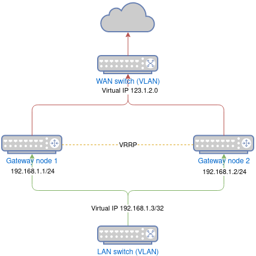
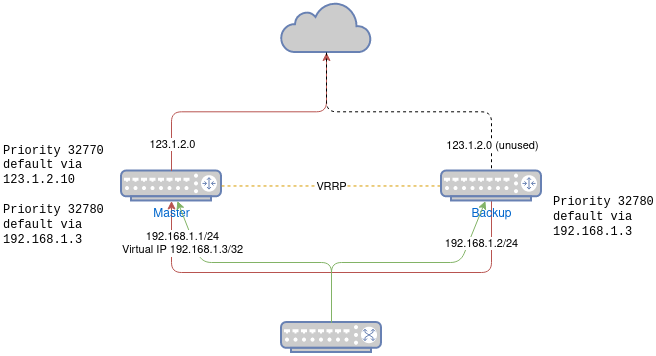

[Homelab Hacks](README.md)

## VRRP Gateway Failover on Single Dynamic Public IP

> I'm not a networking expert. This works well enough for me to keep using at home, but that is about all I will claim.
>
> This does not discuss load balacing or failing over across multiple ISPs.

---

A homelab may not need uptime, but redundant gateways are still convenient for keeping internet access alive while doing maintenance on a node.

We can run two Keepalived VRRP nodes to achieve this, but a typical HA gateway configuration requires three static public IPs - one for each node WAN interface and one floating virtual IP for forwarding. This requirement is a bit steep for most home environments where we typically have one DHCP allocated IP from our ISP.

Here, I share some hacks I've used to make VRRP gateway failover work pretty well with just one dynamic public IP.

**Failover cases tested**

- No interruption seen on common streaming services like Youtube.
- Cloud gaming on [Shadow](https://shadow.tech/) sees a brief sub one second stutter but does not disconnect.
- Cisco AnyConnect VPN to work is unaffected.
- No interruption seen on self hosted HTTP audio stream accessed from remote.

**What doesn't work?**

- Nothing I'm aware of :)

---

> This example uses a common Linux distro with `systemd-networkd`.

### Layout

- This is roughly the layout I have. The modem goes to a switch (WAN VLAN) and connect to WAN interfaces of both gateway nodes. Yes, the modem and switch are still single points of failure, but I don't do much tinkering on these devices, so I rarely need to take them down.

  

### Configure LAN for typical VRRP

- Each node will have a LAN IP, and there will be a third virtual IP that floats between the nodes. Configure this as a Keepalived `virtual_ip` on the LAN interface.

- **systemd-networkd**

  **LAN**

  ```bash
  [Match]
  Name=ens6

  [Network]
  DHCP=false

  [Address]
  Address=192.168.1.1/24
  # For node 2, use
  # Address=192.168.1.2/24
  ```

- **Keepalived**

  **Interface virtual IP**

  ```bash
  vrrp_instance VI_gateway {
    ...
    interface ens6
    virtual_ipaddress {
      192.168.1.3 dev ens6
    }
  }
  ```

### Configure both gateway WAN interfaces to receive the same DHCP IP

- We want both gateway nodes to identify as the same DHCP client to the ISP. There are a few tricks I've found that work for a number of ISPs I've been on.

  1. Assign the same MAC address to the WAN interfaces of both gateway nodes
  2. [Ensure MAC address is sent as a client identifier](https://www.freedesktop.org/software/systemd/man/systemd.network.html#ClientIdentifier=)
  3. [Anonymize the client](https://www.freedesktop.org/software/systemd/man/systemd.network.html#Anonymize=)
  4. [Request server to use broadcast messages](https://www.freedesktop.org/software/systemd/man/systemd.network.html#RequestBroadcast=)

  Now we want to make sure only one WAN interface is active at a given time to avoid MAC conflict.

### Configure only one node to have an active WAN interface

- We can run Keepliaved on both nodes to assign a `master` and `backup` role and configure rules to apply under each role. The gateway node will only forward traffic from LAN to WAN while in `master` mode. To avoid conflict, we don't want any traffic entering or leaving the WAN interface of the `backup` node.

  We could block WAN access while a node is a `backup`, but I prefer all nodes have internet access at all times. We will have the `backup` node fallback to a default route via the LAN virtual IP through the `master` node much like the rest of the LAN network.

  Actual implemetation would have the fallback route over LAN pre-populated on both nodes. We will configure Keepalived to create a higher priority default route over the WAN interface when the node is promoted to `master`.

  

- **systemd-networkd**

  **WAN**

  Set default WAN routes in a new route table `250`. This table is unused until Keepalived promotes the node to `master`. Interfaces will still acquire an address over DHCP, but will otherwise be unused.

  ```bash
  [Match]
  Name=ens7

  [Network]
  DHCP=true

  [DHCP]
  RouteTable=250
  Anonymize=true
  RequestBroadcast=true
  ```

  **LAN**

  Add the default route through LAN virtual IP but in a lower priority routing table. `Route` section adds the default route to a new route table `240` and `RoutingPolicyRule` assigns priority `32780` to the table.

  ```bash
  [Match]
  Name=ens6

  [Network]
  DHCP=false

  [Address]
  Address=192.168.1.1/24
  # For node 2, use
  # Address=192.168.1.2/24

  [Route]
  Gateway=192.168.1.3
  Destination=0.0.0.0/0
  Table=240

  [RoutingPolicyRule]
  Table=240
  Priority=32780
  ```

- **Keepalived**

  **Interface virtual rule**

  On interface transition to `master`, we use Keepalived `virtual_rules` to set route table `250` (WAN default route) to a higher priority `32770` to prioritize it above the LAN default route.

  ```bash
  vrrp_instance VI_gateway {
    ...
    interface ens6
    virtual_ipaddress {
      192.168.1.3 dev ens6
    }
    virtual_rules {
      to all lookup 250 priority 32770
    }
  }
  ```

  Keepalived will automatically remove rules added by `virtual_rules` on transition to `backup`.

- **Routing table summary**

  | ID   | Priority | Routes                           | Notes                                    |
  |------|----------|----------------------------------|------------------------------------------|
  | main | 32760    | `192.168.1.0/24 via 192.168.1.1` | Added automatically by systemd           |
  | 250  | 32770    | `0.0.0.0/0 via 123.1.2.10`       | Added by keepalived on master transition |
  | 240  | 32780    | `0.0.0.0/0 via 192.168.1.3`      | Pre-populated default route              |

### Tweaks

- Add a WAN entry for virtual IP. When Keepalived transitions to `master`, it will send a number of gratuitous ARPs (GARP) for virtual IPs on specified interfaces to quickly switch client devices over to the new node. Because we are working outside of Keepalived to configure the WAN interface, no GARP will be sent for it. Based on testing, a suitable workaround for this is to add `0.0.0.0` as the Keepalived `virtual_ip` for the WAN device.

  ```
  vrrp_instance VI_gateway {
    ...
    interface ens6
    virtual_ipaddress {
      192.168.1.3 dev ens6
      0.0.0.0 dev ens7
    }
    virtual_rules {
      to all lookup 250 priority 32770
    }
  }
  ```

  This would not add any additional IPs or routes, but will simply trigger a GARP on the WAN interface for 0.0.0.0. Based on testing and observing the switch forwarding table, this seems to aid in quickly transitioning the switch port over to the new `master`.

  Finally, we add `garp_extra_if all` and `garp_master_refresh` to ensure GARP is sent on all interfaces on the `vrrp_instance`, and is repeated periodically to keep this table refreshed.

  ```
  vrrp_instance VI_gateway {
    ...
    interface ens6
    garp_master_refresh 60
    garp_extra_if all 60
    virtual_ipaddress {
      192.168.1.3 dev ens6
      0.0.0.0 dev ens7
    }
    virtual_rules {
      to all lookup 250 priority 32770
    }
  }
  ```

- Reduce `garp_master_refresh` time. An interesting observation is that rebooting the `backup` gateway node occasionally briefly breaks internet access.

  `arp_notify` is disabled by default, so my speculation is that whenever the `backup` node makes a DHCP request on the WAN interface, as we have allowed, the switch MAC cache for the WAN interface updates to point to the `backup` node. Spamming GARP via `garp_master_refresh` should, in theory, help recover quickly when this happens.

  ```
  vrrp_instance VI_gateway {
    ...
    interface ens6
    garp_master_refresh 1
    garp_extra_if all 1
    virtual_ipaddress {
      192.168.1.3 dev ens6
      0.0.0.0 dev ens7
    }
    virtual_rules {
      to all lookup 250 priority 32770
    }
  }
  ```

- Enable `use_vmac` on Keepalived. This will create a macvlan interface on each node with the same MAC address, and the virtual IP will be assigned to this interface. This makes the MAC address of the virtual IP consistent on all nodes, and will reduce the impact of failover. Having this set allows my work VPN to stay connected on failover.

- Reduce Keepalived `advert_int` to reduce time to failover. This requires a low latency connection between nodes. This defaults to 1s, which caused connections to my self hosted remote audio stream to drop on failover. Reducing this to 0.1 fixed the issue.

- Set up conntrackd. This replicates connection states between nodes so that they are not lost on failover. I will be honest - I haven't found any tests that show this improve any use case and I'm not actually 100% sure that I have it working correctly. It appears in a number of VRRP examples, so I assume it is helpful. This requires a dedicated network for connection syncing depending on configuration.

---

  > One thing to note is that I have no configuration to actually take the WAN interface of a `backup` node to `DOWN` state.
  >
  > Taking the interface down ensures no MAC conflict but requires adding a Keepalived `notify` script to implement. I'm not a fan of shell scripts in automation (or in general). Failover from a downed interface will also take longer because when the interface is brought up, it will need to request a DHCP address.
  >
  > Currently, both interfaces hold on to their DHCP addresses, and failover takes no additionl time from address assignment. I'm able to run latency sensitive streams with little to no impact during failover and generally haven't ran into any cons with this approach.

### Confguration examples

- WAN interface

  ```bash
  [Match]
  Name=ens7

  [Link]
  RequiredForOnline=false

  [Network]
  LinkLocalAddressing=false
  DHCP=true

  [DHCP]
  UseMTU=true
  RouteTable=250
  Anonymize=true
  RequestBroadcast=true
  ```

- LAN interface

  ```bash
  [Match]
  Name=ens6

  [Network]
  LinkLocalAddressing=false
  DHCP=false

  [Address]
  Address=192.168.1.1/24
  # For node 2, use
  # Address=192.168.1.2/24

  [Route]
  Gateway=192.168.1.3
  Destination=0.0.0.0/0
  Table=240

  [RoutingPolicyRule]
  Table=240
  Priority=32780
  ```

- Conntrackd sync interface

  ```bash
  [Match]
  Name=ens5

  [Network]
  LinkLocalAddressing=false
  DHCP=false

  [Address]
  Address=192.168.190.1/29
  # For node 2, use
  # Address=192.168.190.2/29
  ```

- Keepalived

  ```bash
  global_defs {
    vrrp_version 3
    vrrp_iptables
    use_vmac
    vmac_xmit_base
    nftables keepalived
    dynamic_interfaces allow_if_changes
    max_auto_priority -1
  }
  vrrp_instance VI_gateway {
    no_accept
    nopreempt
    state BACKUP
    advert_int 0.1
    virtual_router_id 60
    interface ens6
    garp_master_refresh 1
    garp_extra_if all 1
    priority 250
    virtual_rules {
      to all lookup 250 priority 32770
    }
    virtual_ipaddress {
      192.168.1.3 dev ens6
      0.0.0.0 dev ens7
    }
  }
  ```

- Conntrackd

  ```bash
  Sync {
    Mode NOTRACK {
      StartupResync on
      DisableInternalCache on
      DisableExternalCache on
    }

    Multicast {
      IPv4_address 225.0.0.50
      Group 3780
      IPv4_interface 192.168.190.1
      # For node 2, use
      # IPv4_interface 192.168.190.2
      Interface ens5
      Checksum on
    }

    Options {
      TCPWindowTracking on
      ExpectationSync on
    }
  }

  General {
    NetlinkEventsReliable on

    UNIX {
      Path /var/run/conntrackd.ctl
    }

    Filter From Kernelspace {
      Protocol Accept {
        TCP
        UDP
        ICMP
      }
      Address Ignore {
        IPv4_address 127.0.0.1
        IPv4_address 192.168.190.0/29
        IPv4_address 192.168.1.1
        IPv4_address 192.168.1.2
        IPv4_address 192.168.1.3
      }
    }
  }
  ```
