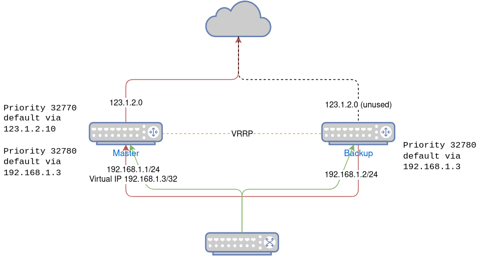

## VRRP Gateway Failover on Single Dynamic Public IP

*Note: I'm not a networking expert. This looks good enough to me to try at home but is not tested for production use.*

---

A homelab may not need uptime, but redunant gateways are still convenient for keeping internet access alive while doing maintenance on a node.

We can run two Keepalived VRRP nodes to achieve this, but a typical HA gateway configuration requires three static public IPs - one for each node WAN interface and one floating virtual IP for forwarding. This requirement is a bit steep for most home environments where we typically have one DHCP allocated IP from our ISP.

Here, I share some hacks I've used to make VRRP gateway failover work pretty well with just one dynamic public IP.

> This example uses a common Linux distro on `systemd-networkd`.
> 
> Note that this does not discuss load balacing or failing over across multiple ISPs.

---

### LAN side is the same as a typical VRRP configuration

- Each node will have a LAN IP, and there will be a third virtual IP that floats between the nodes.

### Both gateway WAN interfaces must be configured for DHCP and must receive the same IP address

- We assume only one IP is available from the ISP. Requesting a second will normally just silenty fail. I've noticed that simply assigning the same MAC address to WAN interfaces of both nodes works for my environment. Both nodes request and can receive and hold the same address at the same time.
  
- We just want to ensure only one WAN interface is active at a time to avoid MAC conflict.

### Configure only one node to have an active WAN interface at a given time

- We can run Keepliaved on both nodes to assign a `master` and `backup` role and configure rules to apply under each role.

- The gateway node will only forward traffic from LAN to WAN while in `master` mode. To avoid conflict, we don't want any traffic entering or leaving the WAN interface of the `backup` node.

- We could block WAN access while a node a `backup`, but I prefer all nodes to have internet access at all times. We will have the `backup` node fallback to a default route over LAN through the `master` node much like the rest of the LAN network.

- Actual implemetation would have the fallback route over LAN pre-populated on both nodes. The higher priority default route over the WAN interface will only be created when the node is promoted to `master`.

  

  **systemd-network configuration**

  **WAN**

  Set default WAN routes in another route table. This table is unused until Keepalived promotes the node to `master`. Interfaces will still acquire an address over DHCP, but will otherwise be unused.

  ```
  ...
  [DHCP]
  RouteTable=250
  ```

  **LAN**

  Add the default route through LAN virtual IP but in a lower priority routing table. `Route` section adds the default route to route table `240` and `RoutingPolicyRule` assigns priority `32780` to the table.

  ```
  ...
  [Route]
  Gateway=192.168.1.3
  Destination=0.0.0.0/0
  Table=240

  [RoutingPolicyRule]
  Table=240
  Priority=32780
  ```

  **Keepalived**

  **Interface virtual rule**

  On interface transition to `master`, we use Keepalived `virtual_rules` to set route table `250` (WAN default route) to a higher priority `32770` to prioritize it above the LAN default route.

  ```
  ...
  virtual_rules {
    to all lookup 250 priority 32770
  }
  ```

  Keepalived will automatically call remove on virtual rules on transition to `backup`.

  **Routing table summary**

  | ID   | Priority | Routes                           | Notes                                    |
  |------|----------|----------------------------------|------------------------------------------|
  | main | 32760    | `192.168.1.0/24 via 192.168.1.3` | Added automatically by systemd           |
  | 250  | 32770    | `0.0.0.0/0 via 123.1.2.10`       | Added by keepalived on master transition |
  | 240  | 32780    | `0.0.0.0/0 via 192.168.1.3`      | Pre-populated default route              |

  ---

  > One thing to note is that I have no configuration to actually take the WAN interface of a `backup` node to `DOWN` state.
  > 
  > Taking the interface down ensures no conflict but require adding a Keepalived `notify` script to achieve. I'm not a fan of shell scripts in automation (or in general) and failover from a downed interface will also take longer because when the interface is brought up, it will need to request a DHCP address.
  > 
  > Currently, both interfaces hold on to their DHCP address, and failover takes no additionl time from address assignment. I'm able to run latency sensitive streams with little to no impact during failover and generally haven't ran into any cons with this setup.

### Tweaks

- Enable `use_vmac` on Keepalived. This will create a macvlan interface on each node with the same MAC address, and the virtual IP will be assigned to this interface. This makes the MAC address of the virtual IP consistent on all nodes, and wil reduce the impact of failover. Having this set allows my work VPN to stay connected on failover.

- Reduce Keepalived `advert_int` to reduce time to failover. This requires a low latency connection between nodes. This defaults to 1s, which caused connections to my self hosted remote audio stream to drop on failover. Reducing this to 0.1 fixed the issue.

- Setup conntrackd. This replicates connection states between nodes so that they are not lost on failover. I will be honest - I haven't found any tests that show this improve any use case and I'm not actually 100% sure that I have it working correctly. It appears in a number of VRRP examples, so I assume it is helpful. This requires a dedicated network for connection syncing depending on configuration.

### Confguration examples

- WAN interface

  ```bash
  [Match]
  Name=ens7

  [Link]
  RequiredForOnline=false

  [Network]
  LinkLocalAddressing=false
  DHCP=true

  [DHCP]
  UseMTU=true
  RouteTable=250
  ```

- LAN interface

  ```bash
  [Match]
  Name=ens6

  [Network]
  LinkLocalAddressing=false
  DHCP=false

  [Address]
  Address=192.168.1.1/24
  # For node 2, use
  # Address=192.168.1.2/24

  [Route]
  Gateway=192.168.1.3
  Destination=0.0.0.0/0
  Table=240

  [RoutingPolicyRule]
  Table=240
  Priority=32780
  ```

- Keepalived sync interface

  ```bash
  [Match]
  Name=ens5

  [Network]
  LinkLocalAddressing=false
  DHCP=false

  [Address]
  Address=192.168.190.1/29
  # For node 2, use
  # Address=192.168.190.2/29
  ```

- Keepalived

  ```bash
  global_defs {
    vrrp_version 3
    vrrp_iptables
    use_vmac
    vmac_xmit_base
    vrrp_garp_master_refresh 60
    nftables keepalived
    dynamic_interfaces allow_if_changes
    max_auto_priority -1
  }
  vrrp_instance VI_gateway {
    no_accept
    nopreempt
    state BACKUP
    advert_int 0.1
    virtual_router_id 60
    interface ens6
    priority 250
    virtual_rules {
      to all lookup 250 priority 32770
    }
    virtual_ipaddress {
      192.168.1.3
    }
  }
  ```

- Conntrackd

  ```bash
  Sync {
    Mode NOTRACK {
      StartupResync on
      DisableInternalCache on
      DisableExternalCache on
    }

    Multicast {
      IPv4_address 225.0.0.50
      Group 3780
      IPv4_interface 192.168.190.1
      # For node 2, use
      # IPv4_interface 192.168.190.2
      Interface ens5
      Checksum on
    }

    Options {
      TCPWindowTracking on
      ExpectationSync on
    }
  }

  General {
    NetlinkEventsReliable on

    UNIX {
      Path /var/run/conntrackd.ctl
    }

    Filter From Kernelspace {
      Protocol Accept {
        TCP
        UDP
        ICMP
      }
      Address Ignore {
        IPv4_address 127.0.0.1
        IPv4_address 192.168.190.0/29
        IPv4_address 192.168.1.1
        IPv4_address 192.168.1.2
        IPv4_address 192.168.1.3
      }
    }
  }
  ```